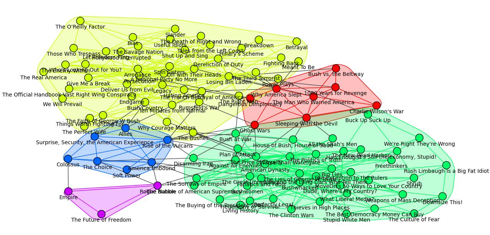

# igraph-on-netdata 

I was working on the [*igraph*](https://igraph.org/) library recently and found it to be an amazing visualization of a relational network, so I'm going to share it briefly here because it's common in the risk management business. First when installing it, be careful not use `pip install igraph`, but as follows.

```
pip install python-igraph
```

Download the datasets from: https://websites.umich.edu/~mejn/netdata/

Visualization effect (e.g. *polbooks*)



See *images* folder to see more effects.
